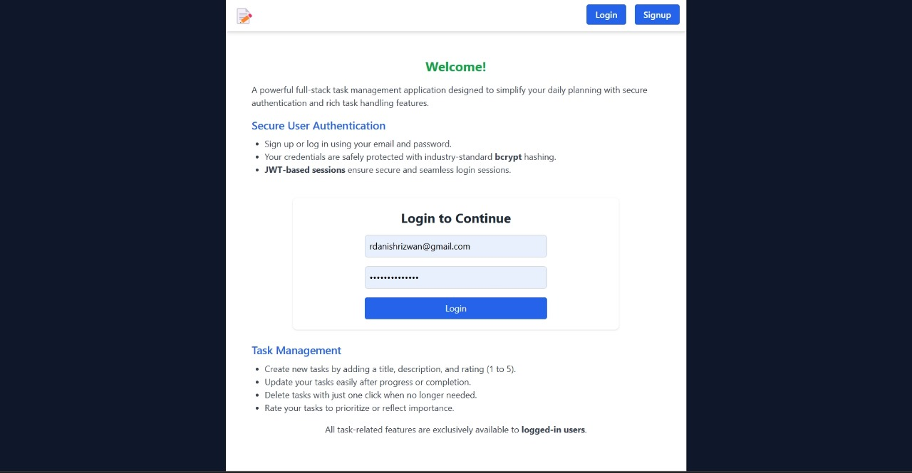

<h1 align="center">📝 Todo App</h1>

###

<p align="center">
  
</p>

### 

<p align="center">
  
</p>

<p align="center"> 
  A powerful full-stack task management application with secure authentication and task handling capabilities.
</p>

<p align="center">
  <a href="https://your-vercel-app.vercel.app" target="_blank">
    🔗 Live Demo
  </a>
</p>

---

## 🌟 Features

✅ **Welcome to the Todo App**  
Simplify your daily task planning with this intuitive and secure task manager.

🔐 **Secure User Authentication**  
- Email/password-based login & signup  
- Passwords hashed using `bcrypt`  
- JWT-based secure sessions  

📝 **Task Management Made Simple**  
- ➕ Create tasks with title, description & rating  
- ✏️ Update your tasks in-place  
- ❌ Delete tasks instantly  
- ⭐ Rate tasks from 1 to 5  

🔒 **Protected Access**  
- Task actions are available only for logged-in users  
- Fully authenticated API and UI access

---

## 🚀 Live Demo

> ✅ Hosted on **Vercel**  
👉 [Click here to view the live app](https://your-vercel-app.vercel.app)

---

## 🛠️ Tech Stack

- **Frontend**: React, Tailwind CSS, React Router  
- **Backend**: Node.js, Express  
- **Database**: MongoDB  
- **Authentication**: JWT + bcrypt  
- **Hosting**: Vercel (Frontend), Render/Backend

---

## 📁 Folder Structure
```
client/
├── public/
│ ├── Home.png
│ └── Dashboard.png
├── src/
│ ├── components/
│ │ ├── Login.jsx
│ │ ├── Signup.jsx
│ │ ├── TaskItem.jsx
│ │ ├── TaskList.jsx
│ │ └── CreateTask.jsx
│ ├── api/
│ │ └── index.js
│ ├── App.jsx
│ └── main.jsx
```
---

## 🧑‍💻 Getting Started

### 📦 Prerequisites

- Node.js
- MongoDB
- npm or yarn

### ⚙️ Backend Setup

```bash
cd server
npm install
npm run dev
```
Create .env with:
```
MONGO_URI=your_mongodb_url
JWT_SECRET=your_secret
PORT=5000
```
💻 Frontend Setup
```
cd client
npm install
npm run dev
```
🗃️ API Endpoints
Method	Endpoint	Description
```
POST	/auth/signup	Register user
POST	/auth/login	Login user
GET	/tasks	Get all tasks
POST	/tasks	Create new task
PUT	/tasks/:id	Update task
DELETE	/tasks/:id	Delete task
```

👤 Contributors
<table> <tr> <td align="center">  <br /><sub><b>Danish Rizwan</b></sub><br /> <sub>Full-Stack Developer</sub> </td> </tr> </table>
📬 Contact
<br>
📧 Email: rdanishrizwan@example.com
<br>


